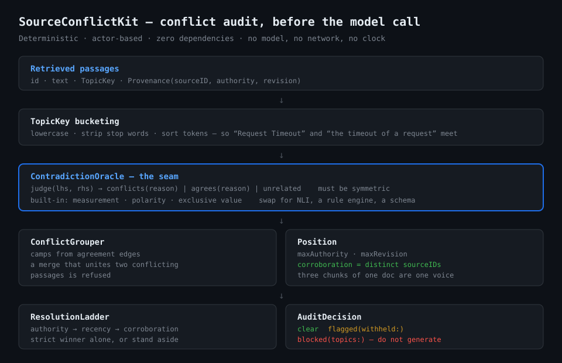
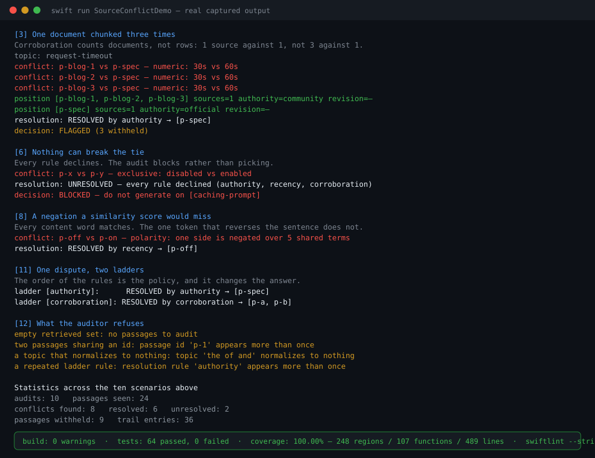

# SourceConflictKit

**Retrieval hands a model five passages and quietly assumes they agree with each other.**

They often don't. One says the timeout is 30 seconds, another says 60. A model given both does not
hedge — it answers confidently, using whichever passage landed closer to the prompt. The
contradiction never surfaces, because nothing in the pipeline was looking for it.

`SourceConflictKit` looks for it, **before the request is sent**. It takes the retrieved set, finds
the topics on which the passages disagree, groups them into positions, and either resolves the
dispute under a declared tie-breaker ladder or refuses to generate at all.

Deterministic, actor-based, Swift 6, zero dependencies. No model call, no network, no clock.

```
Retrieved passages
   → TopicKey bucketing        compare only what is about the same thing
   → ContradictionOracle       pairwise: conflicts / agrees / unrelated   (pluggable)
   → ConflictGrouper           camps → positions, corroboration by document
   → ResolutionLadder          authority → recency → corroboration, strict winner or stand aside
   → ConflictPolicy            clear · flagged · blocked
```



---

## The stage it occupies

Everything else in this toolkit that checks truthfulness — grounding, citation verification,
claim consistency — runs **after** generation. It judges an answer that has already been produced
and already been paid for.

This runs **before**, on evidence alone. The cheapest contradiction to handle is the one caught
while it is still two documents rather than one confident paragraph.

---

## Three properties worth the package

### 1. Corroboration counts documents, not retrieved rows

Three chunks of one blog post all saying "60 seconds" is **one voice**, not three. A rule that
counted passages would let whichever document happened to be chunked most finely win an argument
on volume alone.

```
position [p-blog-1, p-blog-2, p-blog-3]  sources=1  authority=community
position [p-spec]                        sources=1  authority=official
```

`Position.corroboration` is the count of distinct `Provenance.sourceID`s, deduplicated.

### 2. A rule either names a single winner or stands aside

There is no weighted score. A blend would produce a winner every time — including when the
evidence is a dead heat — and nobody reading the report could tell those two cases apart.

Each rule returns a position only when it holds the top score **alone**. A shared maximum is a tie,
and a tie is information: it is what sends the decision down to the next rule. When every rule
declines, the verdict is `.unresolved(tried:)` and it names the rules that ran.

`recency` is stricter still: if **any** position under comparison has no revision, the rule stands
aside entirely rather than ranking a known date against an unknown one.

### 3. Refusal is the point

```swift
case blocked(topics: [String])   // do not generate
```

Handing a model two passages that contradict each other, with nothing to say which is right, does
not produce a hedged answer. `ConflictPolicy.strict` blocks. `.permissive` admits everything and
still names every conflict — it means *someone else decides*, not *nobody noticed*.

---

## Install

```swift
.package(url: "https://github.com/rajatslakhina/source-conflict-kit.git", from: "1.0.0")
```

```swift
.product(name: "SourceConflictKit", package: "source-conflict-kit")
```

---

## Usage

```swift
import SourceConflictKit

let topic = try TopicKey("Request timeout")

let passages = [
    Passage(
        id: "p-spec",
        text: "The request timeout is 30 seconds.",
        topic: topic,
        provenance: Provenance(sourceID: "spec", authority: .official, revision: 12)
    ),
    Passage(
        id: "p-forum",
        text: "The request timeout is 60 seconds.",
        topic: topic,
        provenance: Provenance(sourceID: "forum", authority: .community, revision: 30)
    )
]

let auditor = ConflictAuditor()
let report = try await auditor.audit(passages, policy: .strict, at: tick)

switch report.decision {
case .clear:
    send(passages)
case .flagged:
    send(passages.filter { report.admitted.contains($0.id) })
case .blocked(let topics):
    refuse("Sources disagree about \(topics.joined(separator: ", ")).")
}
```

The forum post is newer, and it still loses: `.standard` puts authority above recency, because a
vendor's own release note outranks a forum post regardless of which was published later. That
ordering is a policy, not a law — pass your own:

```swift
let auditor = ConflictAuditor(ladder: try ResolutionLadder([.corroboration, .recency]))
```

### Provenance is declared, not inferred

`authority` is set at ingestion. A passage cannot argue its way up a tier by sounding confident,
which is the point: the tier is the part of the decision an injected document is not allowed to
influence.

`revision` is a caller-supplied monotonic `Int?`, not a date. A package that reads the clock cannot
be replayed; a package that parses dates inherits a timezone bug it did not write. Your pipeline
already knows which of its documents is newer.

---

## The oracle seam

Pairwise contradiction detection is the part everyone wants to do differently — an NLI model, a
propositional rule engine, a domain schema. So it is a protocol:

```swift
public protocol ContradictionOracle: Sendable {
    var name: String { get }
    func judge(_ lhs: Passage, _ rhs: Passage) -> OracleVerdict   // must be symmetric
}
```

`LexicalContradictionOracle` ships as a working default so the package is useful with no
dependencies — **not** as the recommended one. It reasons over three signals:

| Signal | Conflicts when | Agrees when |
|---|---|---|
| Measurement | same unit, different value | same unit, same value |
| Polarity | one side negated, ≥2 shared content terms | **never** |
| Exclusive value | different members of one declared set | same member |

Its ceiling is deliberate. It will not catch `some providers` widened to `all providers` — that is
quantifier scope, and it belongs in a propositional checker plugged in here.

Three deliberate refusals inside it:

- **Polarity never returns agreement.** Matching polarity over shared words is exactly lexical
  overlap, and treating that as evidence would convert the signal this package distrusts back into
  a vote.
- **Two numbers on one side means decline.** There is no way to tell which one the topic is about,
  and picking the first is a coin flip wearing a rule's clothes.
- **A set naming both members means decline.** "Was enabled, now disabled" asserts neither.

Conflict outranks agreement within a pair. Two passages that quote the same number and disagree
about whether it applies are in conflict; a scheme that let the matching number cancel the negation
would report the pair as corroborating.

### `unrelated` is not a weak `agrees`

They have different consequences. Agreement merges two passages into one position that votes once;
no-evidence leaves them apart. Collapsing the two would turn silence into corroboration.

---

## Agreement is not transitive

A may agree with B, and B with C, while A and C contradict each other outright. Honouring the chain
would build a camp that contradicts itself and then votes as one voice.

The grouper refuses any merge that would place two known-conflicting passages in one position. The
conflict edge wins and the chain breaks where the evidence says it should — verified with a
scripted oracle that returns exactly that inconsistent triple.

---

## Demo

```bash
swift run SourceConflictDemo
```

Twelve sections over ten audits: agreement without conflict, authority resolving, chunk inflation
refused, corroboration deciding, recency deciding, an unbreakable tie blocking, the same tie under
a permissive policy, a negation a similarity score would miss, topic scoping, one dispute under two
different ladders, and every refusal path exercised rather than described.



---

## Quality gates

Measured on this commit, not aspirational:

| Gate | Result |
|---|---|
| `swift build` | **0 warnings, 0 errors** |
| `swift test` | **64 tests, 0 failures** |
| `llvm-cov report` | **100.00% regions (248), functions (107), lines (489)** — every file in the library target |
| `swiftlint lint --strict` | **0 violations across 18 files** — tool-verified, SwiftLint 0.63.2 |

Two defects the gates surfaced, both fixed rather than tested around:

1. **The oracle was not symmetric.** Its reason strings named "left" and "right" and reported
   values in argument order, so `judge(a, b)` and `judge(b, a)` disagreed — while the protocol
   requires symmetry and the grouper relies on it. Values are now reported low-first, members
   alphabetically, and polarity names no side.
2. **A `?? Int.min` fallback in the recency rule was unreachable** behind its own guard.
   Coverage found it. Unreachable code that looks like a safety net is worse than none, because it
   reports as covered risk. Removed, not exercised.

---

## Pairs with

Part of a Swift LLM toolkit built around
[ProviderGatewayKit](https://github.com/rajatslakhina/foundation-model-provider-gateway).

- **[RetrievalKit](https://github.com/rajatslakhina/retrieval-kit)** — produces the passages this
  audits.
- **[ClaimConsistencyKit](https://github.com/rajatslakhina/claim-consistency-kit)** — the natural
  `ContradictionOracle` implementation, and the post-generation counterpart: it checks an answer
  against its sources, this checks the sources against each other.
- **[GroundingKit](https://github.com/rajatslakhina/grounding-kit)** — verifies the answer's claims
  once generation has happened.

## License

MIT
